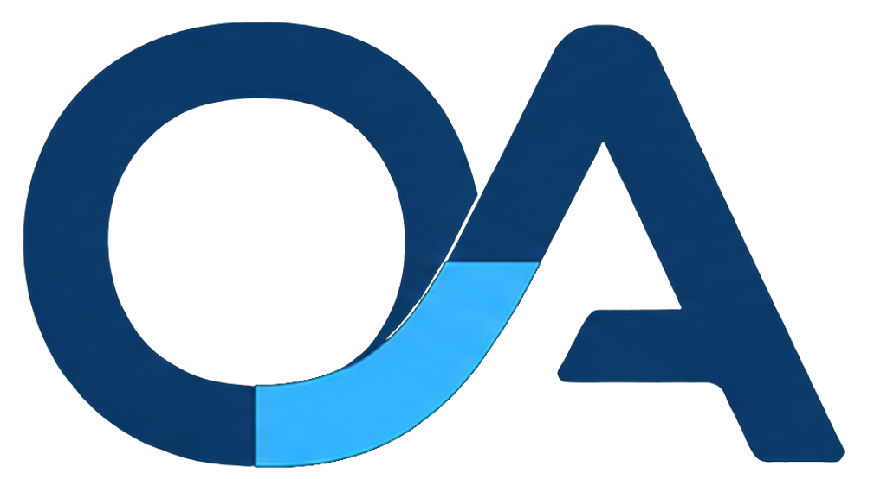

# Operations Automated logo assets

## Source

The continuous OA loop is derived from the founder-supplied high-resolution banner in [`../../references`](../../references). It replaces the incorrect four-block favicon assumption in the first draft.

## Authoritative files

- `../../references/initial-banner-wide-4200x700.png` — highest-resolution supplied source
- `../../references/initial-mark-square-400x400.png` — supplied square treatment
- `../../references/initial-linkedin-profile-cover-1584x396.png` — supplied personal-profile cover

These raster files are working sources, not final vector artwork.

## Generated files

The `generated` directory contains:

- transparent colour, deep-blue and white OA marks at 1024 px;
- contained Obsidian tiles at 32, 192 and 512 px; and
- no inferred vector master.

Regenerate them with `scripts/build-assets.mjs` after a source image changes. The extraction is deterministic and retains the supplied gradient and geometry.

The wordmark remains accessible live type in the browser templates. If the brand is later approved for external distribution, obtain or create a founder-approved vector master and final outlined wordmark, then retain the source-font licence with the release.

## Alternative text

When the full name is visible beside the mark:

```html

<span>Operations Automated</span>
```

When the mark is the only identity on first encounter, use:

```html

```

Do not repeat the same name in both image alternative text and adjacent visible text.
