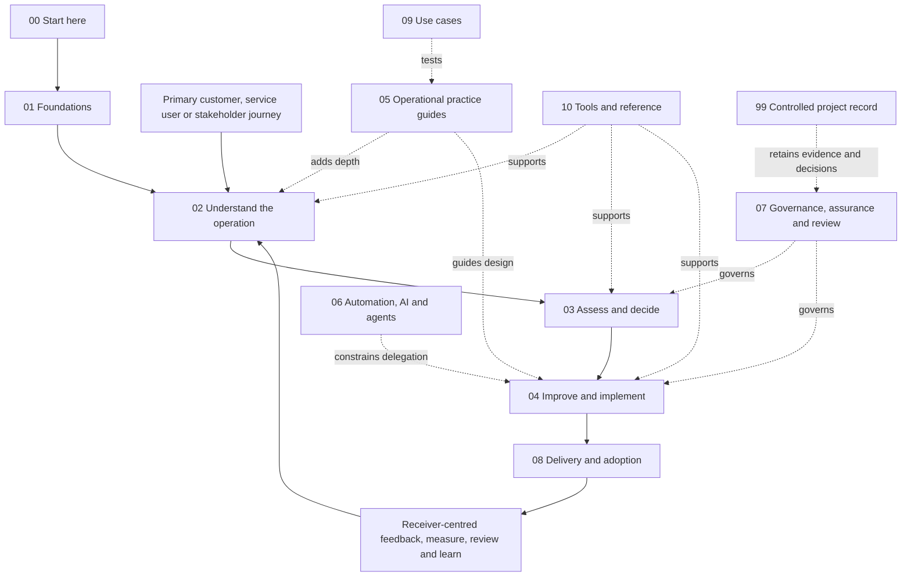

# Operations Automated reader guide

This proposed guide is the reader-first navigation layer for Operations Automated. It gives the methodology a normal book order while preserving the existing files as the authoritative sources.

The guide does not duplicate, approve or replace methodology content. Each chapter index explains what to read, what the material should help a reader produce, how the topic connects to other functions, what guidance currently exists and what remains incomplete. The status recorded on each linked artefact remains authoritative.

## Normal reading order

| Order | Chapter | What the reader should gain |
|---:|---|---|
| 00 | [Start here](00-start-here/README.md) | Choose the shortest route that fits the question, consequence and desired depth |
| 01 | [Foundations](01-foundations/README.md) | Understand purpose, outside-in value, minimum structure, feedback, obligations and human authority |
| 02 | [Understand the operation](02-understand-the-operation/README.md) | Follow the primary journey and see its supporting people, demand, work, decisions and dependencies |
| 03 | [Assess and decide](03-assess-and-decide/README.md) | Form an evidence-based assessment, readiness profile and governed decision |
| 04 | [Improve and implement](04-improve-and-implement/README.md) | Move from observed reality to a tested, usable and retained improvement |
| 05 | [Operational practice guides](05-operational-practice-guides/README.md) | Find the operational discipline and cross-functional linkage relevant to the work |
| 06 | [Automation, AI and agents](06-automation-ai-and-agents/README.md) | Decide what technology should handle and under what human-controlled boundary |
| 07 | [Governance, assurance and review](07-governance-assurance-and-review/README.md) | Keep authority, evidence, risk, approval and methodology change visible |
| 08 | [Delivery and adoption](08-delivery-and-adoption/README.md) | Turn guidance into an understandable, usable output and prove first use |
| 09 | [Use cases](09-use-cases/README.md) | Test the method across materially different operational settings |
| 10 | [Tools and reference](10-tools-and-reference/README.md) | Select templates, examples and authoring rules without treating paperwork as the outcome |
| 99 | [Controlled project record](99-controlled-project-record/README.md) | Inspect evidence, proposals, priorities, product experiments and release history separately from the guide |

The numbers are reading-order keys, not versions or mandatory methodology stages.

## Four reader routes

| Need | Route | Stop or deepen when |
|---|---|---|
| **Ask a quick question** | Start here → apply only the material operational lenses → use the answerability gate → return a direct provisional answer or the smallest useful aid → show the human control point | Stop when the user can act safely and proportionately; deepen when evidence, consequence, dependencies or authority require assessment |
| **Run a full assessment** | Foundations → follow the primary journey → understand its operational injection points → assess and decide → relevant practice guides → produce the retained assessment and recommendation | Continue into implementation only after the target outcome, affected people, trade-offs and authority are explicit |
| **Implement an improvement** | Begin from an authorised outcome → improve and implement → use the minimum useful structure and relevant guidance → test → activate → gather feedback → measure and evolve | Return to understanding or redesign if evidence, readiness, feedback, testing or first use invalidates the design |
| **Govern or review work** | Governance and assurance → inspect evidence, status and authority → use the appropriate decision, assurance or learning record → release or retain the disposition → observe outcomes | No material meaning, risk acceptance, publication or consequential authority changes without the authorised human decision |

## System and book map

This is a connected system rather than a compulsory linear workflow. The normal order teaches the whole method; the four routes let a reader enter at the point that matches their immediate need.

## Status legend

| Status | Meaning in this repository |
|---|---|
| Idea | An unassessed thought, signal or feedback |
| Draft | Work being developed |
| Proposed | Complete enough for formal review but not authorised as current guidance |
| Approved | Authorised for its recorded scope, currently internal use unless stated otherwise |
| Published | Approved for external use |
| Superseded | Retained for history but no longer current |
| Rejected | Considered and deliberately not adopted |

This navigation layer is **proposed**. A linked approved artefact remains approved for its recorded scope; a linked proposed, draft or idea artefact does not become approved because it appears in this guide.

## How to use the chapter indexes

Every chapter index follows the same pattern:

1. purpose and intended reader;
2. questions the chapter answers;
3. topics;
4. expected inputs;
5. outputs;
6. interfaces and hand-offs;
7. current guidance with accurate status;
8. known gaps; and
9. previous and next reading.

Use the [guide authoring standard](10-tools-and-reference/guide-authoring-standard.md) when developing a detailed practice guide. It defines a consistent practice anatomy and a completeness scale that is separate from governance status.

## Boundary

The guide is approved only if and when Jamie Peppard explicitly authorises it. It is not approved for external publication. Confidential employer, client or third-party information, data and proprietary artefacts do not belong in examples, cases or guide content.
