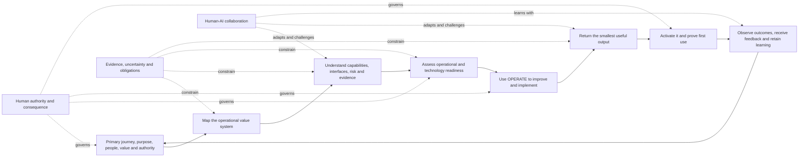

# Current methodology synthesis and visual map

## Status

This is the simplest current view of Operations Automated v0.7. Jamie Peppard approved the v0.7 baseline on 2026-07-24 for internal validation. It is not externally validated or approved for external publication.

## The method at a glance

## Ten working rules

1. Start outside-in with the primary customer, service user, stakeholder or beneficiary journey and the value they need.
2. Move from that journey into the end-to-end operational value system that must deliver and sustain the outcome.
3. Understand capabilities and cross-functional interfaces as a connected system rather than an isolated process.
4. Use the minimum adaptable structure and select methods because they fit the context, not because they are fashionable or comprehensive.
5. Use evidence to decide the justified level of operational, automation, AI or agentic readiness.
6. Improve and simplify before delegating work to technology.
7. Return useful analysis and the smallest usable aid, not forms or questions alone.
8. Keep authority, consequence, obligations, uncertainty and recovery visible.
9. Prove that the user can use the result and make feedback workable for the receiver.
10. Retain learning, expose genuine methodology gaps and evolve the method under human-controlled governance.

## How the components fit

| Layer | Component | Current status |
|---|---|---|
| Direction | [Founder Charter](../CHARTER.md), user-defined value and human-led automation | Approved for internal validation |
| Understanding | [Operational lenses](operational-lenses.md) and [connected work, risk and control](connected-work-risk-and-control.md) | Approved for internal validation |
| Operational territory | [Operational coverage model](operational-coverage-model.md) and [cross-functional interfaces](cross-functional-interfaces.md) | Approved for internal validation |
| Readiness | [Operational readiness path](readiness-path.md) | Approved for internal validation |
| Improvement | [OPERATE](operate-overview.md) | Approved for internal validation |
| Delivery | [Output contract](output-contract.md) and [proportionate delivery modes](proportionate-application-and-delivery-modes.md) | Approved for internal validation |
| Practical use | [Actionable decision aids](actionable-decision-aids.md) using simplicity and progressive disclosure | Approved for internal validation |
| Collaboration | [Human-AI Collaboration Method](human-ai-collaboration.md) | Approved for internal validation |
| Completion | [Activation and first use](activation-and-first-use.md) | Approved for internal validation |
| Evolution | [Methodology evolution system](../evolution/methodology-evolution-system.md) and founder challenge loop | Approved for internal validation |
| Navigation | [Numbered reader guide](../guide/README.md) and [guide authoring standard](../guide/10-tools-and-reference/guide-authoring-standard.md) | Approved for internal validation |

## Feedback coverage

| Founder feedback theme | Where it is now represented | Position |
|---|---|---|
| Operations Automated is wider than OPERATE and must return real value | Architecture, lenses, readiness path and output contract | Approved v0.4/v0.5 baseline |
| Start from demand and value; segment work before automation | Founder synthesis, value principle, lenses and readiness path | Approved v0.5 guidance |
| Replace ceremonial review with capable assurance, training and recovery | Founder synthesis and human-led automation principle | Approved v0.5 guidance; detailed assurance remains to validate |
| Define minimum outcomes and proportionate degraded operation | Founder synthesis, risk-and-control module and readiness path | Approved v0.5 guidance |
| Define criticality through material harm and route authority by consequence | Founder synthesis and connected work, risk and control | Approved v0.5 guidance |
| Link cases, requests, incidents, problems, risks, controls and decisions | Connected work, risk and control | Approved v0.5 module |
| Use one method through Ask and assessment/project modes | Proportionate application and delivery modes | Approved v0.5 module |
| Do not force an answer when evidence is insufficient | Ask-mode answerability gate | Approved v0.5 module |
| Make founder and AI challenge mutual rather than one-in, one-out | Founder challenge and feedback loop | Approved v0.5 mechanism |
| Give users a practical way to work out the answer | Actionable decision aids | Approved v0.6 guidance |
| Keep the first output simple rather than oppressive | Progressive disclosure and shortest-usable-output rule | Approved v0.6 guidance |
| A deliverable is incomplete until the user can activate and use it | Activation and first use | Approved v0.6 guidance |
| Govern how AI understands, represents, challenges, remembers and learns | Human-AI Collaboration Method | Approved v0.6 guidance |
| Begin outside-in and then move into the operational value system | Reader guide, coverage model and cross-functional interface model | Approved v0.7 guidance |
| Make the intended operational territory and current depth visible | Operational coverage model and completeness scale | Approved v0.7 guidance |
| Select and combine methods for the situation | Coverage model, reader guide and guide authoring standard | Approved v0.7 guidance |
| Make feedback workable for the person giving or receiving it | Outside-in guidance, guide routes and evolution system | Approved v0.7 guidance |

## What remains open

The methodology meaning has been captured; the main gaps are now evidence and depth:

- test the v0.7 reader routes with an independent reader;
- apply the outside-in journey-to-operational-value-system sequence to two materially different cases;
- move the highest-value outlined practice families towards usable guidance;
- validate activation and first use across different delivery types;
- continue piloting the Human-AI Collaboration Method across materially different interactions;
- develop deeper guidance for assurance independence, silent harm, recovery and human capability;
- decide which product features support the validated method; and
- complete security, commercial and external-publication decisions separately.

## Control boundary

Jamie Peppard retains final approval over methodology meaning, release, external publication and consequential authority. The v0.7 components are approved only for internal validation and must not be described as externally validated.
