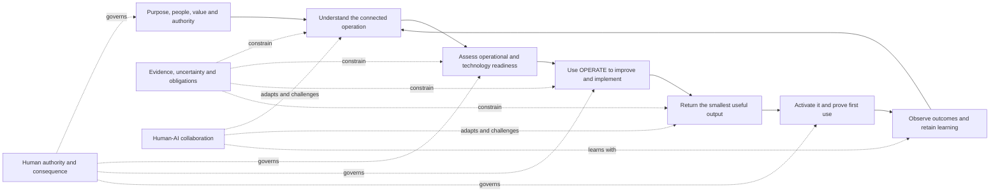

# Current methodology synthesis and visual map

## Status

This is the simplest current view of Operations Automated. It combines the approved v0.5 internal-validation baseline with the latest proposed extensions. It does not change the status of any linked component or approve v0.6.

## The method at a glance

## Seven working rules

1. Start with the intended outcome, beneficiary and user-defined value.
2. Understand the operation as a connected system rather than an isolated process.
3. Use evidence to decide the justified level of operational, automation, AI or agentic readiness.
4. Improve and simplify before delegating work to technology.
5. Return useful analysis and the smallest usable aid, not forms or questions alone.
6. Keep authority, consequence, obligations, uncertainty and recovery visible.
7. Prove that the user can use the result, then retain learning and improve the method.

## How the components fit

| Layer | Component | Current status |
|---|---|---|
| Direction | [Founder Charter](../CHARTER.md), user-defined value and human-led automation | Approved for internal validation |
| Understanding | [Operational lenses](operational-lenses.md) and [connected work, risk and control](connected-work-risk-and-control.md) | Approved for internal validation |
| Readiness | [Operational readiness path](readiness-path.md) | Approved for internal validation |
| Improvement | [OPERATE](operate-overview.md) | Approved for internal validation |
| Delivery | [Output contract](output-contract.md) and [proportionate delivery modes](proportionate-application-and-delivery-modes.md) | Approved for internal validation |
| Practical use | [Actionable decision aids](actionable-decision-aids.md) using simplicity and progressive disclosure | Proposed |
| Collaboration | [Human-AI Collaboration Method](human-ai-collaboration.md) | Proposed |
| Completion | [Activation and first use](activation-and-first-use.md) | Proposed |
| Evolution | [Methodology evolution system](../evolution/methodology-evolution-system.md) and founder challenge loop | Approved for internal validation |

## Feedback coverage

| Founder feedback theme | Where it is now represented | Position |
|---|---|---|
| Operations Automated is wider than OPERATE and must return real value | Architecture, lenses, readiness path and output contract | Approved v0.4/v0.5 baseline |
| Start from demand and value; segment work before automation | Founder synthesis, value principle, lenses and readiness path | Approved v0.5 guidance |
| Replace ceremonial review with capable assurance, training and recovery | Founder synthesis and human-led automation principle | Approved v0.5 guidance; detailed assurance remains to validate |
| Define minimum outcomes and proportionate degraded operation | Founder synthesis, risk-and-control module and readiness path | Approved v0.5 guidance |
| Define criticality through material harm and route authority by consequence | Founder synthesis and connected work, risk and control | Approved v0.5 guidance |
| Link cases, requests, incidents, problems, risks, controls and decisions | Connected work, risk and control | Approved v0.5 module |
| Use one method through Ask and assessment/project modes | Proportionate application and delivery modes | Approved v0.5 module |
| Do not force an answer when evidence is insufficient | Ask-mode answerability gate | Approved v0.5 module |
| Make founder and AI challenge mutual rather than one-in, one-out | Founder challenge and feedback loop | Approved v0.5 mechanism |
| Give users a practical way to work out the answer | Actionable decision aids | Proposed v0.6 |
| Keep the first output simple rather than oppressive | Progressive disclosure and shortest-usable-output rule | Proposed v0.6 correction |
| A deliverable is incomplete until the user can activate and use it | Activation and first use | Proposed |
| Govern how AI understands, represents, challenges, remembers and learns | Human-AI Collaboration Method | Proposed |

## What remains open

The methodology meaning has been captured; the main gaps are now evidence and depth:

- simplify and independently test the first decision aid;
- run a materially different second facilitated case;
- validate activation and first use across two different delivery types;
- pilot the Human-AI Collaboration Method across seven materially different interactions;
- develop deeper guidance for assurance independence, silent harm and human capability;
- decide which proof-of-concept product features support the validated method; and
- complete security, commercial and external-publication decisions separately.

## Control boundary

Jamie Peppard retains final approval over methodology meaning, release, external publication and consequential authority. Proposed modules may be used for internal learning when their status and limitations are visible, but they must not be described as approved or externally validated.
