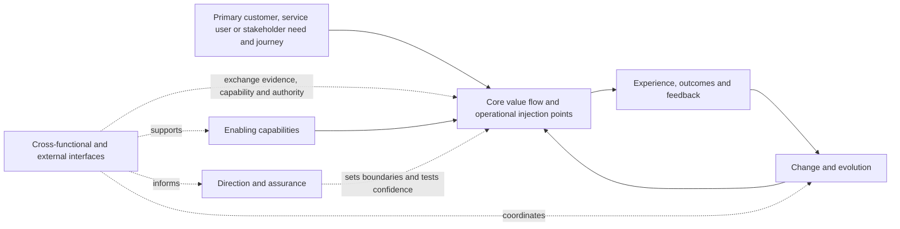
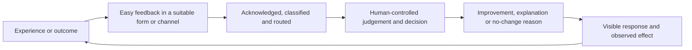

# Operational coverage model

## Purpose and status

This proposed model makes the intended breadth and current depth of Operations Automated visible. It turns the approved [operational lenses](operational-lenses.md) into a coverage catalogue so that a capability is not mistaken for complete guidance merely because it has been named.

It is an inventory and development map, not a maturity score, certification scheme or claim that Operations Automated replaces a specialist framework. The levels below describe the depth and evidence of methodology guidance for a capability. They do not assess how mature, compliant or effective a user's operation is.

The v0.6 baseline provides a credible architecture and several usable internal methods. It does not yet contain detailed practice guidance for every operational capability. No capability in this initial catalogue is claimed to be externally validated or publishable.

## Coverage levels

| Level | Meaning | Minimum evidence |
|---|---|---|
| **Identified** | The capability is recognised as part of operational scope, but usable guidance has not yet been developed. | A clear name, purpose and reason it may matter |
| **Outlined** | The important questions, relationships and expected outputs are described. | Scope, principal considerations, interfaces and intended output |
| **Usable** | A person can apply repeatable guidance proportionately and retain a useful result. | Roles, inputs, method, controls, outputs, template or aid, and at least one worked example or internal use |
| **Validated** | The guidance has produced useful outcomes in materially different real or realistic cases and has been revised against observed failure. | Retained case evidence, user feedback, limitations, transfer test and outcome review |
| **Publishable** | The guidance is approved for an external audience and can be maintained responsibly. | Validation plus editorial, accessibility, intellectual-property, legal, release, versioning and support checks |

Coverage levels are cumulative. A capability should be moved only when the required evidence exists. If guidance works only for one work type, user or setting, record that boundary rather than raising the whole capability.

The coverage level is separate from the repository governance state. For example, an approved internal document may contain only outlined coverage, while a proposed guide may contain usable detail that has not yet been authorised.

## Whole-system view

The four groups are connected views, not departments or a sequence of handovers. A change in one group can alter value, workload, risk, cost or recovery elsewhere.

## Outside-in starting principle

Begin with the primary customer, service user or stakeholder whose outcome gives the operation purpose. Follow their trigger, request, click, interaction or journey from the experience they have to the outcome they need. Where there is no conventional customer, identify the primary beneficiary, receiver or affected party rather than inventing one.

Only then map the operational injection points needed to make that journey work:

- information the person needs or supplies;
- work, decisions and communications that move the journey forward;
- people, knowledge and judgement involved;
- controls, authority and obligations that protect the outcome;
- technology, data, assets and suppliers that enable it;
- exceptions, failures, escalation and recovery; and
- feedback that shows whether the promised outcome was actually experienced.

Internal functions and process steps support the journey; the journey should not be designed around the convenience of an organisation chart or system. Analyse both the visible experience and the less visible operational work that sustains it.

“Customer first” does not mean “customer only”. The method must expose consequences for employees, other users, suppliers, communities and future customers. It must also retain applicable legal, safety, ethical, resilience, accessibility and human obligations. A pleasing front-stage experience is not successful if it depends on hidden harm or an operation that cannot recover.

## Minimum useful structure

Operations Automated may reuse useful practices, language or tools from Lean, ITIL, IT4IT and other established approaches where they help the user understand and improve the operation. It does not require wholesale adoption, claim compliance or treat any framework as doctrine.

Start with the minimum explicit structure that makes purpose, work, ownership, authority, evidence, feedback and recovery understandable. Then:

1. use it in the real context;
2. observe whether it improves the intended journey and outcome;
3. retain what works;
4. adapt what is confusing, excessive or incomplete;
5. add detail where weak understanding or control intersects with material value, consequence or dependency; and
6. remove structure that creates effort without useful control, learning or value.

No first design is assumed to be final. The structure exists to support development and learning, not to preserve itself. This makes Operations a value-creating capability for products, services and stakeholders rather than treating it only as cost or administrative burden.

## Receiver-centred feedback loop

Feedback is part of the operational journey, not an afterthought or a request designed around the delivery team's convenience.

Design the loop so that:

- the person can give or receive feedback with proportionate effort, accessibility and context;
- the channel and representation fit that person and situation;
- ownership, status and the expected response are visible;
- feedback is connected to the relevant journey, work, problem, risk, product or decision;
- automation may capture, validate, route, summarise, remind and report where authorised;
- AI may find patterns and propose changes but may not infer approval or accept consequence; and
- the loop ends with a retained lesson, decision, improvement or explicit no-change reason, followed by outcome review where material.

## Initial v0.6 coverage snapshot

| Capability group | Identified | Outlined | Usable internally | Validated | Publishable | Total |
|---|---:|---:|---:|---:|---:|---:|
| Core value flow | 1 | 9 | 2 | 0 | 0 | 12 |
| Enabling capabilities | 7 | 5 | 1 | 0 | 0 | 13 |
| Direction and assurance | 4 | 4 | 2 | 0 | 0 | 10 |
| Change and evolution | 4 | 3 | 3 | 0 | 0 | 10 |
| **Total** | **16** | **21** | **8** | **0** | **0** | **45** |

This is a methodology-depth snapshot, not an operational maturity result. “Usable internally” means that the v0.6 baseline contains a repeatable internal method or working guidance; it does not mean independent validation or external readiness. The detailed tables below show the evidence and gap behind every classification.

## How to use the model

1. Identify the primary customer, service user, stakeholder or beneficiary and follow their journey to the intended outcome.
2. Define the operation, boundaries, affected people, minimum outcomes and authority.
3. Locate the operational injection points and capabilities that could materially affect the journey and outcome.
4. Record why each selected capability is relevant and why any consequential capability is excluded.
5. Check the available methodology coverage and its evidence boundary.
6. Use available guidance where it is sufficient; use an appropriate specialist method or authorised expert where it is not.
7. Retain gaps, interfaces, decisions, feedback routes and the next proportionate action.
8. Feed repeated or consequential guidance gaps into the methodology evolution system.

Do not complete every capability at maximum depth for every question. Proportionality changes the amount of work, not whether a material dependency, obligation or affected person may be ignored.

## Group 1: Core value flow

Core value-flow capabilities connect an original need to a realised and observed outcome.

| Capability | Intended scope | Current v0.6 coverage | Current anchor | Principal guidance gap |
|---|---|---|---|---|
| Purpose, beneficiaries, value and minimum outcomes | Define why the operation exists, for whom and what must be sustained | Usable | User-defined value, value matrix and methodology architecture | Validate across competing stakeholder and non-commercial outcomes |
| User, customer, citizen, employee and stakeholder experience | Understand needs, accessibility, effort, trust, communication and possible harm | Outlined | People-and-experience lens | Journey methods, experience measures, inclusion tests and feedback handling |
| Demand, access and intake | Understand where work comes from, how people reach the operation and what enters it | Outlined | Demand-and-work-types lens | Intake design, demand forecasting, channel choice, eligibility and failed-demand analysis |
| Classification, priority and routing | Separate materially different work and send it to the right treatment | Outlined | Connected-work module and category-first decision aid | Definitions, severity and priority methods, routing controls and worked examples |
| Case and interaction management | Retain an end-to-end need, context, communication and related work | Outlined | Connected-work record model | Case lifecycle, ownership, consent, communication, closure and measures |
| Requests, incidents, complaints, exceptions, audits and planned work | Manage different triggers and outcomes without forcing them into one lifecycle | Outlined | Operational lenses and connected-work definitions | Practice-level lifecycles, escalation, closure, evidence and cross-record rules |
| Flow, queues, workload, capacity and handovers | Make movement, waiting, rework, constraints and transfer of responsibility visible | Outlined | Flow-and-dependencies lens and OPERATE Examine | Mapping techniques, queue and capacity analysis, handover standards and flow measures |
| Process, service, journey and standard-work design | Define normal, exceptional, escalation and recovery routes | Outlined | OPERATE Redesign and the output contract | Design method, service blueprint, procedure hierarchy, decision logic and examples |
| Decisions, approvals and escalation | Put the decision with the authority appropriate to its consequence | Usable | Charter, connected-work module and decision record | Cross-organisational testing and clearer routine-versus-material decision thresholds |
| Fulfilment, communication and closure | Deliver the required outcome, communicate its state and close work with evidence | Identified | Output contract and activation guidance | End-to-end fulfilment, notification, acceptance, closure and reopen criteria |
| Problem, cause and prevention | Investigate recurring or systemic conditions and prevent avoidable demand or harm | Outlined | Connected-work module and OPERATE Examine | Root-cause methods, known-error treatment, prevention ownership and effectiveness review |
| Outcome, performance and feedback | Establish whether value was realised and whether unintended effects occurred | Outlined | Performance-and-learning lens and output contract | Measure design, baselines, service levels, benefits tracking and feedback-to-action rules |

## Group 2: Enabling capabilities

Enabling capabilities provide the people, knowledge, information, technology, resources and environment through which value flows.

| Capability | Intended scope | Current v0.6 coverage | Current anchor | Principal guidance gap |
|---|---|---|---|---|
| People, roles, skills, capacity and wellbeing | Ensure the operation has capable people, sustainable workload and meaningful human involvement | Outlined | People lens, human-led automation and founder synthesis | Workforce planning, role design, competence, training, workload and wellbeing methods |
| Organisation design, leadership, culture and incentives | Align structures and behaviour with end-to-end outcomes | Identified | People and ownership lenses | Operating-model patterns, leadership routines, incentives, conflict and cultural change |
| Knowledge, instructions and records | Make current, usable knowledge available at the point of work and retain material evidence | Outlined | Ownership-and-knowledge lens and evidence discipline | Knowledge lifecycle, procedure standards, review, expiry, findability and reuse |
| Data, information and evidence governance | Define information needs, quality, lineage, ownership, access, retention and deletion | Outlined | Information lens and readiness path | Data-quality controls, stewardship, master data, lineage, retention and records management |
| Technology, applications, infrastructure, integration and architecture | Support the operation reliably without letting technology dictate the outcome | Outlined | Technology lens and readiness path | Architecture method, non-functional needs, lifecycle, integration, support and technical debt |
| Conventional automation, AI and bounded agents | Select and govern the lowest justified level of delegation | Usable for internal validation | Human-led automation, readiness path and OPERATE Automate | Real deployment cases, evaluation packs, operational monitoring and provider guidance |
| Security, privacy, identity and access | Protect people, information, services and delegated authority | Outlined | Risk lens, AI readiness and connection boundaries | Threat and privacy assessment, identity lifecycle, access review, incident and assurance practices |
| Suppliers, procurement, outsourcing and third parties | Obtain and govern external capability while retaining outcome ownership and an exit route | Identified | Dependency and risk references | Sourcing, due diligence, contracts, service levels, concentration risk, assurance and exit |
| Financial resources, cost and benefits | Understand affordability, resource consequences and realised benefits without assuming cost is primary value | Identified | Value principle and authority model | Cost model, business case, budget, investment decision, benefits and financial controls |
| Assets, configuration, inventory and physical resources | Know what resources support the operation, their condition, relationships and ownership | Identified | Technology and dependency lenses | Asset lifecycle, configuration relationships, stock, maintenance, loss and reconciliation |
| Channels, communication and collaboration | Make access, status, commitments and handovers understandable across participants | Identified | People lens and output contract | Channel design, communication ownership, accessibility, collaboration and record rules |
| Facilities, workplace and physical environment | Provide safe, available and suitable places and equipment for work | Identified | Risk and dependency lenses | Facilities capacity, maintenance, access, emergency arrangements and workplace design |
| Physical and sector-specific operations | Extend the method to manufacturing, logistics, supply chain, inventory, field service, care, public service and other contexts | Identified | Broad architecture scope only | Sector extensions, physical-flow methods, asset and safety patterns, cases and terminology tests |

## Group 3: Direction and assurance

Direction and assurance capabilities establish priorities, boundaries, confidence and accountability.

| Capability | Intended scope | Current v0.6 coverage | Current anchor | Principal guidance gap |
|---|---|---|---|---|
| Strategy, policy and target operating model | Translate purpose and external conditions into operational direction and design | Outlined | Charter, methodology architecture and OPERATE Redesign | Strategy deployment, policy hierarchy, capability model and target operating-model guidance |
| Portfolio, investment and prioritisation | Compare competing operational changes and allocate limited attention and resources | Identified | OPERATE Prioritise and value matrix | Portfolio criteria, capacity allocation, sequencing, dependencies and benefits governance |
| Governance, ownership and authority | Make outcome ownership, delegated authority and retained accountability visible | Usable for internal validation | Charter, governance model, connected-work module and templates | Validation outside founder governance and guidance for federated or networked organisations |
| Risk, controls, fraud and ethical consequence | Identify uncertainty and harm, design effective treatment and retain risk decisions | Usable for internal validation | Connected work, risk and control | Detailed control design, fraud patterns, appetite translation, testing and residual-risk reporting |
| Compliance, legal, regulatory and contractual obligations | Connect specialist obligations to work, decisions and evidence | Identified | Boundary and escalation requirements | Obligation register, change monitoring, contract linkage and specialist hand-off guidance |
| Quality, assurance and audit | Test whether outcomes and controls work, using proportionate independence and competence | Outlined | Test stage, founder synthesis and assurance packs | Quality planning, sampling, independence, audit lifecycle, findings and corrective action |
| Resilience, continuity, crisis and recovery | Sustain defined minimum outcomes through disruption and recover deliberately | Outlined | Readiness path, connected-work module and founder synthesis | Business-impact analysis, tolerances, severe scenarios, crisis roles, exercises and recovery plans |
| Health, safety, accessibility, human rights and wellbeing | Prevent unacceptable harm and design inclusive, humane work and services | Identified | Charter obligations, TIGIPI and people lens | Specialist integration, hazard and accessibility methods, consultation, reporting and assurance |
| Sustainability and environmental or social impact | Make resource, environmental and longer-term social effects visible in operational decisions | Identified | User-defined value can include these outcomes | Materiality, measures, lifecycle effects, supplier impacts, claims and reporting guidance |
| Measurement, reporting and transparency | Provide decision-useful evidence about outcomes, risk, flow, quality, experience and change | Outlined | Output contract and performance lens | Metric hierarchy, definitions, ownership, reporting cadence, data controls and decision use |

## Group 4: Change and evolution

Change and evolution capabilities move an operation from current reality to a retained improvement without losing control of live work.

| Capability | Intended scope | Current v0.6 coverage | Current anchor | Principal guidance gap |
|---|---|---|---|---|
| Continuous operational improvement | Observe, prioritise, examine, redesign, automate, test and evolve proportionately | Usable for internal validation | OPERATE | Practice techniques, complete worked cases and cross-context validation |
| Process, service and operating-model redesign | Define a better target state, alternatives, controls and transition needs | Outlined | OPERATE Redesign and output contract | Design patterns, option assessment, co-design, simulation and target-state artefacts |
| Project, programme and change planning | Coordinate outcomes, scope, dependencies, resources, decisions and delivery | Identified | Assessment/project mode and implementation outputs | Planning, governance, dependency, issue, benefit and closure guidance |
| Product, service and portfolio lifecycle | Govern discovery, introduction, operation, improvement and retirement | Identified | Product and delivery-system evidence | Lifecycle, ownership, roadmap, service acceptance, retirement and portfolio integration |
| Change enablement, release, deployment and adoption | Move authorised change into use while controlling cumulative and operational risk | Outlined | OPERATE Test, activation and first use | Change assessment, scheduling, release, deployment, adoption, rollback and early-life support |
| Testing, evaluation and experimentation | Prove value, controls, exception handling and recovery under realistic conditions | Outlined | OPERATE Test and learning-through-failure | Test strategy, evaluation sets, acceptance criteria, experiment design and independent assurance |
| Learning, review and retained improvement | Convert outcomes and failures into a lesson, decision or improvement | Usable for internal validation | OPERATE Evolve and learning-review template | Organisational learning measures, knowledge reuse and independent validation |
| Methodology evolution | Turn evidence and feedback into AI-drafted, human-approved method changes | Usable with founder evidence | Evolution system, founder challenge loop and assurance pack | Independent users, multiple feedback sources, release outcome review and external governance |
| Innovation, horizon scanning and changed conditions | Detect emerging needs, technology, threats, obligations and opportunities | Identified | Evolution sources and review triggers | Signal selection, evidence quality, ownership, cadence and portfolio connection |
| Transition, benefits, retirement and decommissioning | Confirm realised outcomes and remove obsolete work, controls, data, access and technology safely | Identified | Activation, recovery and review concepts | Transition plan, benefit review, decommission, archive, access removal and residual obligation |

## Cross-functional and external interfaces

No operational capability works alone. Use the proposed [cross-functional interface model](cross-functional-interfaces.md) to define why an interface exists, when it is triggered, what information or decisions move in each direction, who has authority and when escalation is required.

The named interfaces are capabilities and responsibilities, not assumed departments. A small organisation may have one person carrying several responsibilities, use an external adviser or combine a record and decision meeting. Combining roles does not remove the need to expose a conflict of interest, missing competence or decision beyond that person's authority.

## Proportionality for individuals and small organisations

- Treat a capability as a responsibility that must be considered, not a demand to create a team or committee.
- Use the lightest record that preserves the decision, evidence, owner and review trigger.
- One person may hold several roles for low-consequence work, but should not claim independent assurance of their own consequential decision.
- Use external or shared specialist capability where legal, safety, security, financial or other expertise is required.
- Escalate to the person who can accept the consequence, even where no formal hierarchy exists.
- Keep a practical recovery route when a key person, supplier, tool or physical resource is unavailable.

## Sector and context extensions

The core model should remain stable while sector extensions add obligations, terminology, work types, evidence and controls. Candidate extensions include:

- digital and IT-enabled services;
- customer and back-office operations;
- financial and regulated services;
- public and community services;
- health, care and safety-critical work;
- manufacturing and production;
- logistics, warehousing and supply chain;
- retail, hospitality and branch operations;
- field service, maintenance and facilities; and
- personal or sole-practitioner workflows.

An extension must state what is universal, what is context-specific, which specialist authority applies and what evidence supports transfer. It must not imply certification or compliance merely because a relevant topic is included.

## Review and development rule

Use the [operational coverage and interface map](../templates/operational-coverage-and-interface-map.md) during cases and methodology reviews. Prioritise new guidance where:

- a capability is material to the outcome but only Identified or Outlined;
- users repeatedly require facilitation to apply it;
- a missing interface causes delay, harm, rework or unowned decisions;
- current guidance transfers poorly to another scale or sector;
- a failure reveals a missing control, recovery route or affected person; or
- an external change makes the current evidence or boundary unreliable.

Moving coverage from Identified to Publishable is not the objective by itself. Develop the depth that creates justified value, retain honest limitations and stop when a specialist method is the more responsible route.
