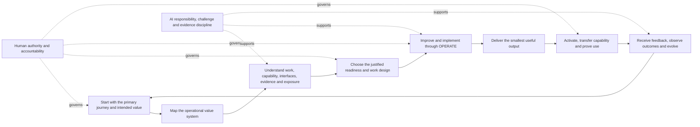

# Operations Automated v0.8 consolidated methodology

## Status

This is the proposed next version of Operations Automated. It keeps the approved v0.7 baseline and brings the remaining Human-AI Collaboration, accountability, manual-work, delivery-collaboration, capability-transfer and plain-language feedback into one reviewable draft.

It is available for internal review only. Git merge and publication beneath the controlled Confluence Draft parent do not approve its meaning or promote it to Live.

## Purpose

Operations Automated helps an individual, team or organisation understand, govern, improve and evolve operations so that intended value becomes a repeatable, responsible outcome.

It works in an environment that may include people, manual work, conventional technology, automation, AI and bounded agents. It does not assume that more technology is the answer. It helps the authorised human choose the arrangement that creates justified value while keeping consequence, accountability, obligations and recovery visible.

OPERATE — Observe, Prioritise, Examine, Redesign, Automate, Test and Evolve — is the improvement and implementation cycle inside the wider methodology. It is not the complete methodology.

## The method at a glance

This is a connected system. A quick question may need only part of it; a consequential change may require every part and deeper specialist practice.

## Twelve commitments

1. **Begin outside-in.** Start with the primary customer, service user, stakeholder or beneficiary journey, the trigger that matters and the outcome they need.
2. **Move into the operation.** Map the end-to-end operational value system that must deliver and sustain the outcome, starting from the first operational event.
3. **Use connected evidence.** Understand work, demand, flow, people, decisions, information, technology, risk, control, resilience, performance and learning as interacting parts.
4. **Use minimum adaptable structure.** Select and combine methods because they fit the situation; do not confuse more framework with more rigour.
5. **Return value while learning.** Give a useful provisional answer or smallest usable aid before transferring more analysis back to the user.
6. **Design work deliberately.** Choose consciously between manual work, AI assistance, rules-based automation, bounded agents and “not ready”.
7. **Improve before delegating.** Do not automate unclear work or scale avoidable failure.
8. **Separate responsibility, authority and accountability.** AI is responsible for its assigned contribution; an authorised human remains accountable for consequential operational outcomes.
9. **Make review meaningful.** People need relevant evidence, time, authority and a real way to challenge, condition, reject or stop a recommendation.
10. **Design for delivery and capability.** Involve operational, product, technical and specialist expertise early and leave the receiving organisation able to operate, recover and improve.
11. **Lead in plain language and explain effects before action.** Put meaning, uncertainty, next action and human control first; keep technical trace inspectable through progressive disclosure.
12. **Learn under governance.** Make feedback workable for the receiver, retain material evidence and change approved meaning only through explicit human authority.

## 1. Frame the outcome and boundary

Establish proportionately:

- the question, problem, opportunity or change;
- the primary journey and intended outcome;
- beneficiaries and materially affected people;
- user-defined value and minimum acceptable outcomes;
- scope, exclusions and time horizon;
- authority, accountability and ownership;
- legal, safety, ethical, professional and information obligations; and
- what useful progress can be returned now.

The absence of complete information is not a reason to return nothing. State what the current evidence supports and ask only for information that could materially change the conclusion.

## 2. Follow the journey into the operational value system

Use the primary journey to locate why the work matters and where value, harm, delay or failure appears. Then move inward to the operation.

Map:

- what enters the work and what triggers it;
- required outcomes and minimum outcomes;
- work types, demand, variation and exceptions;
- activities, decisions, queues, hand-offs and dependencies;
- people, roles, knowledge and capability;
- information, evidence, technology and integrations;
- exposure, controls, resilience, recovery and assurance;
- measures and feedback; and
- the conditions that sustain or degrade the outcome over time.

Operations Automated centres the operational system without claiming authority over whole specialist functions. Finance, People, Risk, Legal, Technology, Product and other capabilities retain their own authority and contribute through explicit interfaces.

## 3. Assess current reality and readiness

Distinguish recorded evidence, human judgement, AI inference, assumption and recommendation. Test contrary evidence, affected stakeholders, boundary conditions, time horizon, failure and authority where they could change the answer.

Readiness is a profile, not one maturity score. Assess whether purpose, work, ownership, information, control, capability, technology, recovery and evidence are strong enough for the proposed change.

The result may be:

- continue or improve deliberately manual work;
- use AI to assist a human-controlled activity;
- apply bounded rules-based automation;
- delegate bounded multi-step work to an agent;
- strengthen capability or controls first; or
- stop because the value, evidence, authority or consequence does not justify action.

## 4. Improve and implement with OPERATE

Use OPERATE proportionately:

| Stage | Decision-useful result |
|---|---|
| Observe | Current-state evidence, affected journeys, work patterns, exceptions and material gaps |
| Prioritise | Ranked opportunities with value, minimum outcomes, trade-offs, dependencies and authority |
| Examine | Causes, system interactions, evidence quality, uncertainty and failure conditions |
| Redesign | Target operating design, options, affected people, controls, capability and transition needs |
| Automate | Deliberate manual, assistance, automation or agent decision with explicit boundaries |
| Test | Evidence of normal, boundary, failure and recovery behaviour, plus residual exposure |
| Evolve | Retained outcomes, feedback, decisions, learning and review triggers |

Return to an earlier point when new evidence invalidates the working design. Progress through stage names is not success.

## 5. Design the human, AI and technology arrangement

| Arrangement | Suitable when | Minimum controls |
|---|---|---|
| Deliberately manual | Human judgement, empathy, tacit knowledge, physical presence or accountability is central | Purpose, owner, capacity, information, control, recovery and improvement route |
| AI-assisted | Analysis or generation helps but contextual or consequential judgement remains human | Evidence boundary, review criteria, correction route and named authority |
| Rules-based automation | Work is understood, repeatable and bounded by reliable rules | Exception route, monitoring, owner, stop condition and rollback |
| Bounded agent | A specific goal and operating environment justify multi-step action | Identity, least privilege, permitted and prohibited actions, approvals, observability and recovery |
| Not ready | The operation, information, capability, authority or exposure is unclear | Return to understanding, redesign or capability development |

Technology may execute, analyse and recommend. It does not create its own permission or transfer accountability merely because it can perform the work.

## 6. Work with AI without losing the human boundary

AI should:

- reconstruct the strongest reasonable meaning before challenging;
- do the analytical work before asking for judgement;
- form a provisional view rather than return an unprocessed menu;
- challenge the user's and its own preferred conclusion when it has decision value;
- disclose evidence, inference, assumptions, uncertainty and limitations;
- use plain language and the smallest useful representation;
- execute only within explicit permission;
- retain traceable evidence and correct material failures; and
- explain what an action will and will not do before asking the person to take it.

The authorised human supplies or retains purpose, lived context, value, empathy, judgement, authority and accountability. Meaningful human control requires decision-ready evidence and the ability to disagree.

## 7. Deliver, activate and transfer capability

The main output should lead with:

1. current understanding;
2. evidence-based findings and interpretation;
3. uncertainty and material trade-offs;
4. a recommendation and next action;
5. the human control point; and
6. what will be retained.

Internal paths, hashes, control mechanics and status labels remain available as inspectable detail unless they materially affect the decision.

Creation is not completion. A deliverable is complete only when the intended receiver can reach it, understand it, take the first useful action and recover from foreseeable difficulty — or when a blocker and recovery route are explicit.

Where an intervention changes how work operates, leave the receiving people able to:

- perform their role;
- understand the relevant system and boundaries;
- challenge recommendations and controls;
- recognise failure or drift;
- recover or escalate; and
- improve the result without permanent dependence on the original delivery team.

## 8. Receive feedback and evolve

Make feedback easy in a form and channel that work for the person giving or receiving it. Explain the effect before asking them to classify, save, escalate or approve anything.

Treat feedback as evidence. Separate:

- a correction to the current answer;
- context that should remain with one conversation;
- a reusable working-agreement update;
- evidence to review;
- a methodology-change candidate;
- a product-change candidate; and
- a no-change disposition with retained reasoning.

A methodology change moves through:

> retained feedback → contextual interpretation and counter-test → disposition → proposal → implementation and checks → human release decision → approved baseline

The Workbench may support capture, routing, drafting, Git preparation and Confluence Draft publication. It cannot approve methodology meaning or infer convergence from silence, repetition, fluency or technical readiness.

## Proportionate routes

| Need | Minimum route | Typical output |
|---|---|---|
| Quick question | Frame → material lenses → answerability gate | Direct provisional answer, uncertainty and next action |
| Full assessment | Frame → journey → operational value system → readiness → recommendation | Connected assessment, options, target state and roadmap |
| Implement improvement | Authorised outcome → OPERATE → test → activation and capability transfer | Working change, evidence, controls, recovery and retained learning |
| Govern or review | Evidence → authority → alternatives → decision → conditions and review | Traceable decision, approval, rejection, risk treatment or no-change record |

Choose the shortest route that can responsibly create value. Deepen when consequence, uncertainty, dependencies, obligations or authority require it.

## Completion standard

A proportionate application should leave:

- a clear outcome, beneficiary, value definition and boundary;
- a connected picture of the current operation;
- an evidence-based readiness and work-design decision;
- visible alternatives, trade-offs and authority;
- a usable recommendation or implemented change;
- risks, controls, tests, recovery and measures proportionate to consequence;
- activated use and capability transfer where relevant; and
- retained feedback, decisions and learning.

## What this draft changes

Relative to the approved v0.7 baseline, this proposal:

- incorporates the pending Human-AI Collaboration v0.3 themes;
- adds the explicit AI-responsibility and human-accountability distinction;
- makes meaningful human review a control requirement;
- makes manual work an intentional design choice;
- requires early operational, product, technical and specialist collaboration where material;
- adds capability transfer to completion;
- makes plain-language progressive disclosure and informed action explicit; and
- connects receiver-centred feedback to the Workbench-supported evolution route.

It does not change the v0.7 outside-in sequence, OPERATE stages, status authority, confidentiality boundary or Jamie Peppard's approval authority.

## Known gaps and validation

Before approval, test:

- whether an independent reader can explain the method and choose a proportionate route;
- two materially different outside-in cases, including one outside conventional service management;
- one deliberately manual design;
- one early operational-product-technical design decision;
- one consequential AI recommendation that a human can meaningfully challenge and reject;
- one capability-transfer outcome;
- whether Workbench feedback and Confluence Draft publication preserve status and authority; and
- whether the consolidated wording creates avoidable duplication or hidden contradictions.

## Decision required

Jamie Peppard may approve, revise, defer or reject the proposed changes. Until that explicit decision, v0.7 remains the current approved internal methodology.
