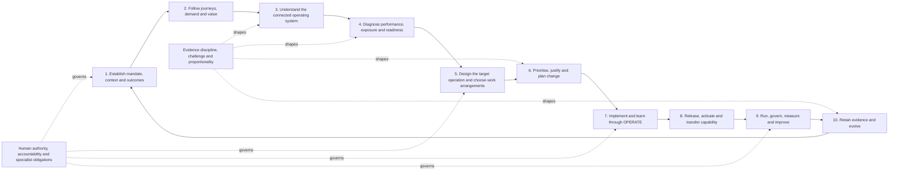

# Operations Automated v0.8 end-to-end business methodology

## Status and claim boundary

This is the proposed next version of Operations Automated. The approved internal methodology remains v0.7 until Jamie Peppard explicitly approves a change.

This revision responds to evidence that the first consolidated v0.8 reading draft was too light to act as an end-to-end working method. It turns the existing architecture into a fuller route for understanding, designing, changing, running and improving the operational system of a business.

The method can connect operational work with strategy, finance, people, risk, legal, security, data, technology, product, suppliers, customers, quality, safety and sustainability. It does not replace the standards, professional judgement or accountable authority of those disciplines. A Git merge or publication beneath the private Confluence Draft parent records a reviewable proposal; it does not approve the methodology or authorise external publication.

## Purpose

Operations Automated helps an individual, team or organisation turn an intended outcome into a repeatable, responsible and improving operational reality.

It provides a common method to:

- understand why an operation exists and whose outcomes matter;
- follow demand and experience from the outside into the work;
- see the business as a connected operating system rather than isolated processes;
- make evidence, assumptions, trade-offs, risk and authority visible;
- decide deliberately how work should be performed by people, conventional technology, automation, AI or bounded agents;
- design and deliver useful change without losing control or capability;
- activate the change so that it works in normal use; and
- learn from outcomes and evolve both the operation and the methodology.

OPERATE — Observe, Prioritise, Examine, Redesign, Automate, Test and Evolve — is the improvement and implementation cycle inside this wider method. It is not the complete methodology.

## What the method should leave behind

A proportionate application should leave more than analysis. It should leave:

1. a clear outcome, beneficiary, boundary, value definition and mandate;
2. a connected view of journeys, demand, work, capability and dependencies;
3. an evidence-based explanation of current performance and material causes;
4. visible obligations, exposure, controls, decisions and accountable authority;
5. a deliberate target operating design and work-allocation choice;
6. prioritised action, a justified case for change and an achievable roadmap;
7. a tested implementation with exception, stop and recovery routes;
8. activated use and transferred operational capability;
9. measures that connect activity to outcome, value, control and learning; and
10. a retained decision and evidence trail that can support review and evolution.

The amount of documentation should scale with consequence and uncertainty. A small reversible improvement may be expressed on one page. A regulated, cross-business or agentic change may need detailed evidence, specialist assurance and separate approvals.

## The complete method

The sequence is logical, not rigid. Work can begin at the point where a real need appears, but the practitioner should check upstream assumptions before making a consequential recommendation. New evidence can return the work to an earlier stage.

## Operating commitments

The following commitments constrain every application.

1. **Begin outside-in.** Start with the primary customer, service user, stakeholder or beneficiary journey, the trigger that matters and the outcome they need.
2. **Move into the operation.** Follow the journey to the first operational event, then map the value system that must deliver and sustain the outcome.
3. **Treat the operation as a system.** Examine purpose, demand, work, people, decisions, information, technology, assets, suppliers, controls, performance and learning together.
4. **Define value with the affected user.** Do not allow internal activity, technical output or assumed efficiency to substitute for the outcome that matters.
5. **Use connected evidence.** Separate recorded evidence, human judgement, AI inference, assumptions and recommendations.
6. **Use minimum adaptable structure.** Apply only the depth and artefacts needed to make the decision responsibly.
7. **Return value while learning.** Give a useful provisional answer or smallest usable aid before transferring avoidable analysis back to the user.
8. **Design work deliberately.** Choose consciously among manual work, AI assistance, rules-based automation, bounded agents and not ready.
9. **Improve before delegating.** Do not automate unclear work, encode avoidable failure or use technology to conceal a broken operating design.
10. **Separate responsibility, authority and accountability.** AI is responsible for the quality and faithful execution of its assigned contribution; authorised humans and organisations retain consequential authority and accountability.
11. **Make review meaningful.** A reviewer needs relevant evidence, enough time, suitable competence or advice, decision authority and a real route to challenge, condition, reject, pause or stop.
12. **Design with delivery and operation.** Involve operational, product, technical and specialist expertise early enough to shape feasibility, control, maintainability and adoption.
13. **Design for failure and recovery.** Test normal, boundary, exceptional and degraded conditions; provide monitoring, intervention, rollback and learning routes.
14. **Complete through use.** Creation is not completion. The receiver must be able to reach, understand, use, challenge, recover and improve the result.
15. **Lead in plain language.** Put meaning, uncertainty, recommendation, next action and human control first; keep technical trace available through progressive disclosure.
16. **Learn under governance.** Retain material outcomes and feedback, but change approved meaning only through explicit human authority.

## 1. Establish mandate, context and outcomes

### Decision to make

What are we trying to change or understand, why now, for whom, within what boundary, and with whose authority?

### Core work

- Describe the trigger: problem, opportunity, obligation, incident, decision or learning need.
- Identify the primary beneficiary and materially affected stakeholders.
- Define the intended outcome, the minimum acceptable outcome and unacceptable outcomes.
- Connect the work to relevant strategy, policy, service promise, commercial model or public purpose.
- State scope, exclusions, time horizon, material constraints and known dependencies.
- Identify the accountable owner, decision authorities, delivery responsibility and specialist authorities.
- Record what is known, what is assumed, what is disputed and what evidence would change the position.
- Decide what useful answer or action can be returned now without pretending the assessment is complete.

### Outputs

- outcome-and-boundary statement;
- stakeholder and authority map;
- initial evidence and assumption register;
- material obligation and dependency list; and
- next governed action.

### Gate

Do not proceed to design a consequential change if the outcome, authority or unacceptable consequences are materially unclear. A provisional diagnostic answer may still be given with the limitation stated.

## 2. Follow journeys, demand and value

### Decision to make

What experience and result must the operation create, and what real demand enters the system?

### Core work

- Select the primary journey rather than attempting to map every stakeholder at once.
- Identify the initiating need, trigger, context, expected outcome and end condition.
- Map the experience over time, including effort, waiting, uncertainty, repetition, exclusion, failure and recovery.
- Distinguish value demand from failure demand, planned work from interrupts, standard work from exceptions and stable demand from material variation.
- Define value in the user's terms and connect it to organisational sustainability and obligations.
- Find the first operational event required to respond to the journey.
- Trace where hand-offs, queues, missing information, policies, decisions or controls alter the outcome.
- Check the reverse journey: what happens when the user disputes, cancels, fails, returns, complains or needs recovery?

### Outputs

- journey and demand map;
- user-defined value and minimum-outcome statement;
- demand segmentation and variation profile;
- pain, harm, failure-demand and recovery evidence; and
- trace from the journey to the operation.

### Gate

Do not call an internally convenient output valuable unless it contributes to the intended external or stakeholder outcome and remains sustainable for the organisation.

## 3. Understand the connected operating system

### Decision to make

What combination of capabilities, work, people, information, technology, assets, suppliers and governance currently produces the outcome?

### Core work

Build the current-state picture through connected lenses:

- **purpose and outcomes:** promises, objectives, policies and success conditions;
- **demand and work:** work types, volumes, variation, queues, hand-offs, decisions, exceptions and rework;
- **people and organisation:** roles, workload, skills, incentives, culture, wellbeing, authority and tacit knowledge;
- **information and knowledge:** inputs, records, definitions, provenance, quality, access, retention and learning;
- **technology and assets:** systems, integrations, tools, physical assets, constraints, ownership and lifecycle;
- **suppliers and partners:** dependencies, service boundaries, contracts, performance, concentration and exit;
- **governance and control:** obligations, decisions, risk, controls, assurance, escalation, resilience and recovery; and
- **performance and improvement:** outcome, flow, quality, cost, capacity, control, adoption and learning measures.

Trace cause across interfaces rather than stopping at an organisational boundary. A delay in one team may originate in policy, data, demand shaping, supplier design, prioritisation or an incentive elsewhere.

### Outputs

- operating-system and capability map;
- end-to-end work and decision flow;
- role, information, technology and supplier dependency maps;
- current control, resilience and recovery view;
- baseline measures and evidence gaps; and
- named cross-functional issues and owners.

### Gate

The picture is sufficient when it explains the outcome and material variation well enough to support a decision. It need not document every activity. Deepen where consequence, uncertainty or dependency makes the omitted detail material.

## 4. Diagnose performance, exposure and readiness

### Decision to make

Why does the current system behave as it does, what matters most, and what is it ready to change?

### Evidence discipline

Label important statements as:

- **recorded evidence:** observed, measured or traceable information;
- **human judgement:** contextual interpretation by a named person;
- **AI inference:** a reasoned conclusion generated from available material;
- **assumption:** an unverified condition required by the current view; or
- **recommendation:** an advised course of action.

Test the preferred explanation using relevant reverse, boundary, transfer, stakeholder, contrary-evidence, time-horizon, failure and authority tests. Do not manufacture disagreement; challenge where the result could change.

### Readiness profile

Assess readiness as a profile rather than one maturity score:

- clarity of purpose and work boundary;
- stability and intelligibility of the work;
- ownership, authority and accountability;
- demand, capacity and capability;
- information quality, provenance and permitted use;
- control, security, privacy, safety and compliance;
- technology and integration fitness;
- observability, exception handling and recovery;
- implementation and adoption capability; and
- evidence that the proposed value justifies the change.

### Outputs

- evidence-backed problem and opportunity statements;
- causal explanation and competing hypotheses;
- exposure, control and obligation assessment;
- readiness profile by work type;
- uncertainty and evidence-needs register; and
- recommendation on whether to continue, redesign, learn or stop.

### Gate

Do not progress a preferred solution when the evidence supports only the existence of a symptom. Do not use a readiness score to hide a critical weakness in authority, data, control or recovery.

## 5. Design the target operation and choose work arrangements

### Decision to make

What future operating arrangement can produce the intended outcome responsibly, and who or what should perform each part of the work?

### Design sequence

1. Remove work that should not exist, including avoidable failure demand, duplicate approval and unused output.
2. Simplify the journey, policy, decision or flow before adding technology.
3. Reconfigure work around outcomes, sensible boundaries and reduced hand-offs.
4. Define roles, authority, information, controls, measures, exception paths and recovery.
5. Generate materially different options, including a credible non-technology or no-change option.
6. Allocate work deliberately among people, conventional systems, automation, AI and bounded agents.
7. Check the design with affected users, operators, delivery teams and relevant specialists.
8. Describe transition states; do not assume the organisation can move directly from current to target.

### Work-allocation choices

| Arrangement | Suitable when | Minimum design conditions |
|---|---|---|
| Deliberately manual | Human judgement, empathy, tacit knowledge, physical presence or accountable discretion creates value | Purpose, owner, capacity, competence, information, control, continuity and improvement route |
| AI-assisted | Analysis or generation helps while contextual or consequential judgement remains human | Evidence boundary, review criteria, permitted data, correction route and named authority |
| Rules-based automation | Work is understood, repeatable and bounded by reliable rules | Rule ownership, exception route, monitoring, stop condition, rollback and change control |
| Bounded agent | A defined goal and environment justify multi-step action | Identity, least privilege, permitted and prohibited actions, approvals, observability, spend and time limits, recovery and accountability |
| Not ready | Work, evidence, capability, authority or exposure is materially unclear | Defined learning, stabilisation, redesign or capability action before reconsideration |

### Outputs

- target operating model and service design;
- option comparison and design rationale;
- future journey, work, decision and information flows;
- role, authority and work-allocation model;
- target controls, measures, recovery and assurance requirements;
- transition states and dependencies; and
- residual uncertainty and exposure.

### Gate

No technology capability creates its own permission. The selected design must be desirable, operationally viable, technically feasible, economically justified and governable for the consequence involved.

## 6. Prioritise, justify and plan change

### Decision to make

Which intervention should proceed, in what order, with what commitment and under what conditions?

### Core work

- Compare options against user value, organisational value, obligations, feasibility, risk, reversibility, time to learning and opportunity cost.
- Identify the smallest useful intervention that can test the key uncertainty or create real value.
- Estimate benefits as ranges and causal hypotheses, not guaranteed claims.
- Include implementation, transition, operating, control, support and exit costs.
- Make displaced work and constrained capacity visible; a new priority does not create capacity.
- Sequence dependencies, capability development, technical enablers, policy changes and approvals.
- Define benefit owners, decision points, stop conditions and review triggers.
- Obtain the correct human and specialist decisions before commitment.

### Outputs

- prioritised opportunity portfolio;
- option and trade-off record;
- proportionate business case or decision brief;
- benefit, cost, exposure and assumption model;
- roadmap with dependencies and decision gates;
- resource and capability plan; and
- approval, rejection, deferral or learning decision.

### Gate

Do not describe an unresourced aspiration as a roadmap. Do not aggregate weak assumptions into a precise benefit claim. The authorised decision maker must understand what is being committed, what remains uncertain and how the decision can be revisited.

## 7. Implement and learn through OPERATE

Use OPERATE at the scale of the intervention. The stages are decision disciplines, not a sequential paperwork process.

| Stage | Essential work | Decision-useful result |
|---|---|---|
| **Observe** | Gather current evidence, affected journeys, work patterns, exceptions, constraints and prior learning | Current-state evidence and material gaps |
| **Prioritise** | Rank needs by value, obligation, consequence, dependency, feasibility and time to learning | Authorised focus and success conditions |
| **Examine** | Test causes, alternatives, system interactions, evidence quality and failure conditions | Defensible problem definition and design requirements |
| **Redesign** | Co-design target work, roles, information, controls, measures, interfaces and transition | Coherent target and change hypothesis |
| **Automate** | Choose and implement the justified manual, assistance, automation or agent arrangement | Bounded working intervention with ownership |
| **Test** | Test value, usability, normal, boundary, exceptional, degraded and recovery behaviour | Evidence for release, revision or stop |
| **Evolve** | Observe use, compare outcomes, retain decisions and feed learning into operation and method | Sustained improvement and next review |

Delivery should use small increments where practical, but the increment must be operationally meaningful. Technical completion alone is not a usable increment if the receiving operation cannot use, control or recover it.

### Outputs

- delivery backlog tied to outcomes and risks;
- implemented process, service, control, technology or capability change;
- test evidence and defect/exception decisions;
- updated operating instructions and ownership;
- release recommendation with conditions; and
- retained learning and design changes.

### Gate

Return to an earlier stage when new evidence invalidates the problem, target or control assumptions. Progress through the stage names is not evidence of success.

## 8. Release, activate and transfer capability

### Decision to make

Is the change safe and useful to release, and can the receiving operation sustain it without permanent dependence on the delivery team?

### Release and activation

- Confirm acceptance evidence against outcome, control, usability, performance and recovery conditions.
- Decide release authority and any conditions, limited scope, feature controls or monitoring period.
- Prepare data, access, support, communications, training, work instructions and operational capacity.
- Provide an exception, incident, rollback and continuity route.
- Make the first useful action clear and test that the intended receiver can complete it.
- Observe early use rather than treating availability as adoption.
- Correct inaccessible, confusing or unsafe delivery before declaring completion.

### Capability transfer

The receiving people should be able to:

- perform their role in the changed system;
- understand the relevant purpose, boundaries and dependencies;
- inspect or challenge recommendations and controls;
- recognise failure, drift or misuse;
- recover, stop or escalate appropriately;
- maintain relevant information, rules and access; and
- improve the operation without unnecessary dependence on the original team.

### Outputs

- release and acceptance record;
- operational readiness and support plan;
- communication, learning and role-transition material;
- first-use and adoption evidence;
- rollback, continuity and recovery arrangements; and
- capability-transfer acceptance.

### Gate

Creation is not completion. If the intended receiver cannot reach, understand, use, challenge or recover the result, either continue activation or record the blocker and recovery route explicitly.

## 9. Run, govern, measure and improve

### Decision to make

Is the operation producing the intended outcome within its obligations and tolerances, and what intervention is now justified?

### Operating rhythm

- Monitor a balanced set of outcome, demand, flow, quality, capacity, cost, control, adoption, resilience and learning measures.
- Review material exceptions, incidents, complaints, overrides, control failures and emerging demand.
- Compare observed outcomes with the change hypothesis and the minimum acceptable outcome.
- Distinguish normal variation from meaningful deterioration or improvement.
- Revisit priorities when demand, strategy, obligations, technology or risk changes.
- Maintain ownership, access, rules, data, documentation, supplier arrangements and recovery capability.
- Retire controls, technology and work that no longer justify their cost or consequence.
- Use OPERATE for material improvement and a lighter action loop for bounded correction.

### Outputs

- operational performance and control view;
- exception, incident and recovery learning;
- benefit and unintended-consequence review;
- prioritised improvement and retirement actions;
- updated risk, control, capability and dependency records; and
- explicit decisions with conditions and review dates.

### Gate

Do not equate local target achievement with system success. Check whether performance was shifted to another team, future period, stakeholder, risk or unmeasured outcome.

## 10. Retain evidence and evolve

### Decision to make

What should be corrected locally, retained as evidence, reused as guidance or proposed as a methodology change?

### Feedback route

Make feedback possible in a channel and form that works for the person giving or receiving it. Explain the effect before asking them to classify, save, escalate, approve or publish anything.

Separate:

- correction of the current answer or deliverable;
- context that belongs only to one situation;
- a reusable working-agreement update;
- operational learning or evidence;
- a methodology-change candidate;
- a product-change candidate; and
- a no-change disposition with retained reasoning.

For methodology feedback, retain source, boundary, evidence, inference and affected content; reconstruct the strongest contextual meaning; apply proportionate counter-tests; state what changed, where disagreement remains and what is uncertain; then choose no change, clarification, accumulate evidence or propose change now.

A material methodology change moves through:

> retained feedback → contextual interpretation and counter-test → disposition → separate proposal → implementation and checks → assurance pack → explicit human release decision → approved baseline

The Workbench may support capture, routing, drafting, Git preparation and private Confluence Draft publication. It cannot approve methodology meaning, promote content to Live or infer convergence from silence, repetition, fluency, fatigue or technical readiness.

## Cross-functional application

Operations Automated owns the connected operational view. It uses explicit interfaces with specialist functions:

| Interface | Operational questions | Specialist authority retained |
|---|---|---|
| Strategy and leadership | What outcome, priority and trade-off does the operation serve? | Strategic commitment and enterprise direction |
| Finance and commercial | What is affordable, valuable and sustainable over its lifecycle? | Accounting treatment, capital, tax, treasury and financial approval |
| People and organisation | What roles, capability, capacity, consultation and wellbeing are affected? | Employment, reward, formal organisation and people-policy decisions |
| Legal, risk and compliance | What obligations, rights, exposure and assurance apply? | Legal interpretation, risk acceptance and regulatory decisions |
| Security, privacy and safety | What harm, access, data, threat and safe-operation conditions matter? | Specialist standards, acceptance and statutory duties |
| Data and knowledge | What information is needed, permitted, reliable and maintainable? | Data governance, records, ownership and technical standards |
| Technology, architecture and assets | What is feasible, supportable, resilient and lifecycle-appropriate? | Architecture, engineering, service and asset decisions |
| Product, portfolio and change | What should be prioritised, delivered, adopted and retired? | Portfolio commitment and product/change governance |
| Suppliers and partners | Which external dependency, obligation, performance and exit conditions apply? | Commercial negotiation and supplier authority |
| Customers, sales and marketing | What promise, demand and feedback are being created? | Market, proposition, communication and customer-policy decisions |
| Audit and quality | What independent evidence and conformance are required? | Audit opinion, certification and formal quality authority |
| Facilities, environment and sustainability | What physical, environmental and long-term effects matter? | Relevant technical, statutory and organisational decisions |

An interface is successful when the required specialist is engaged early enough to change the design, their decision and evidence are retained, and accountability is not blurred by collaboration.

## Human–AI working agreement

AI should:

- reconstruct the strongest reasonable meaning before challenging;
- perform the analysis it can before asking a person for judgement;
- form a provisional view rather than return an unprocessed menu;
- challenge the user's and its own preferred conclusion when it could change the decision;
- disclose evidence, inference, assumptions, uncertainty and limitations;
- use the smallest useful representation and plain language;
- execute only within explicit permission and technical boundaries;
- retain traceable evidence and correct material failures; and
- explain what an action will and will not do before asking the person to take it.

The authorised human or organisation retains purpose, lived context, empathy, value judgement, authority, risk acceptance and accountability. Human involvement is not meaningful merely because a person clicks a button. Review must be decision-ready and capable of changing the outcome.

## Proportionate application routes

| Need | Minimum route | Typical output |
|---|---|---|
| Quick operational question | Frame → material lenses → answerability check | Direct provisional answer, uncertainty, recommendation and next action |
| Improvement diagnosis | Frame → journey → connected operation → causes → priorities | Current-state assessment, opportunity and bounded action |
| Full operating-model assessment | Context → journeys → capability system → exposure/readiness → target design | Connected assessment, options, target state and roadmap |
| Implement change | Authorised outcome → OPERATE → release → activation → capability transfer | Working change, evidence, controls, recovery and ownership |
| Govern or review | Evidence → obligations/authority → alternatives → decision → conditions | Traceable approval, rejection, deferral, risk treatment or no-change record |
| Incident or urgent failure | Stabilise → protect people/value → establish authority → diagnose → recover → learn | Safe containment, restored service, evidence and prevention action |

Choose the shortest route that can responsibly create value. Deepen when consequence, uncertainty, dependency, novelty, reversibility, obligation or contested authority requires it.

## Standard output contract

The main response or deliverable should lead with:

1. current understanding and boundary;
2. material evidence and interpretation;
3. uncertainty, assumptions and trade-offs;
4. a recommendation and next governed action;
5. the human decision or control point; and
6. what evidence, decision or learning will be retained.

Technical paths, hashes, configuration, detailed matrices and control mechanics should remain available as inspectable detail when relevant, but they should not obscure the decision.

## Completion tests

Before calling an application complete, ask:

- **Outcome:** Is the intended result and minimum acceptable outcome explicit?
- **System:** Are material journeys, work, interfaces and dependencies understood?
- **Evidence:** Can important claims be traced, and are assumptions visible?
- **Choice:** Were credible alternatives, including manual and no-change options, considered?
- **Authority:** Did the right people make the consequential decisions?
- **Control:** Are obligations, risks, controls, exceptions and recovery proportionate?
- **Delivery:** Was the change tested under normal, boundary and failure conditions?
- **Use:** Can the receiver access, understand and perform the first useful action?
- **Capability:** Can the operation run, challenge, recover and improve the result?
- **Learning:** Are measures, review triggers, decisions and feedback retained?

If a failed test materially affects the outcome, continue the work or record a blocker. Do not use completion language to hide unfinished activation or assurance.

## What this revision changes

Relative to the approved v0.7 baseline and the first v0.8 draft, this proposal:

- retains the v0.7 outside-in sequence and makes the end-to-end business lifecycle explicit;
- expands the method from a conceptual synthesis into practical stages with inputs, activities, outputs and gates;
- integrates the pending Human–AI Collaboration themes, including responsibility, accountability and meaningful review;
- makes manual work a positive design choice rather than unmanaged residue;
- gives people, work, governance, information, technology, suppliers and cross-functional interfaces explicit treatment;
- connects target operating design to prioritisation, business case, roadmap and transition;
- expands implementation into release, activation, adoption, recovery and capability transfer;
- adds an operating rhythm for benefit, control, resilience, retirement and improvement;
- strengthens plain-language progressive disclosure and informed action; and
- retains an explicit boundary around specialist authority and external validation.

It does not change Jamie Peppard's approval authority, the status authority, the confidentiality boundary, the prohibition on inferred approval or the distinction between private Draft publication and Live promotion.

## Known gaps and validation required

This is a substantially fuller proposed method, not proof of universal completeness. Before approval or broader use, test:

- whether an independent reader can use the material to produce the standard outputs without author support;
- a small-team case and an enterprise cross-functional case;
- a non-service and non-technology operating context;
- an urgent recovery case and a longer-horizon operating-model change;
- a deliberately manual design and a bounded agentic design;
- a case where a specialist function changes or rejects the operational proposal;
- whether the method reveals displaced cost, risk or effort across boundaries;
- whether the layered structure supports both mobile reading and deep application;
- whether the artefact set is proportionate rather than burdensome; and
- whether outcome, adoption, recovery and capability persist after delivery.

The operational coverage catalogue also remains honest: several practice areas are outlined or identified rather than usable or externally validated. Further practice guides and real cases are still required.

## Decision required

Jamie Peppard may approve, revise, defer or reject this proposed v0.8 meaning. Until that explicit decision, v0.7 remains the current approved internal methodology and the expanded material remains a private proposed Draft.
