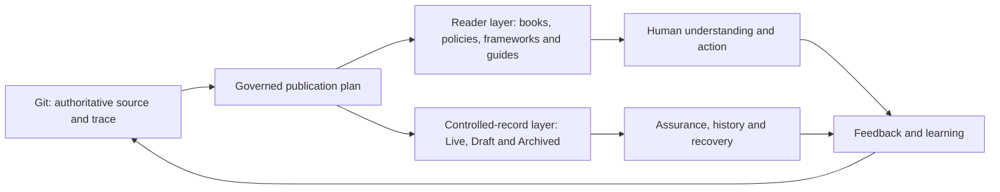
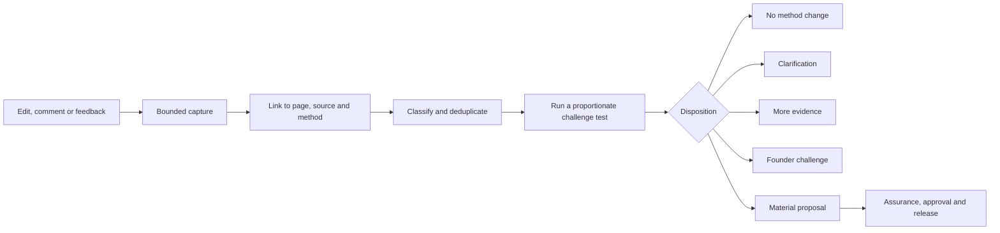

# Confluence human publication model

## Purpose

This model separates the controlled repository from the human reading experience without separating either from governance.

- **Git remains the authoritative source:** complete project memory, status, changes, evidence and technical trace.
- **Confluence becomes the human publication:** curated methodology, organisational documentation and task-focused guidance.
- **The Workbench remains the governed publisher:** it builds a reviewable plan, exposes meaning and status changes, requires Jamie's confirmation and retains returned Confluence versions.

Confluence should not be a prettier directory listing. It should help a person understand the organisation, learn the methodology or complete a task.

## Two publication layers

### 1. Reader layer

The primary route is designed around what a person is trying to understand or do. It uses authored introductions, deliberate sequencing, progressive disclosure, examples and related guidance.

### 2. Controlled-record layer

The complete Live, Draft and Archived repository view remains available for governance, traceability, review and recovery. It is secondary to the ordinary reading route but is never hidden or discarded.

## Methodology space

The Methodology space should teach Operations Automated rather than expose its repository modules in alphabetical or lifecycle order.

### Approved primary tree

1. **Start here**
   - What Operations Automated is
   - Who it is for
   - What it can and cannot do
   - How to read and apply the methodology
   - Current approval and validation boundary
2. **Read the methodology**
   - Part I — Purpose, value and the human boundary
   - Part II — Start with the customer, service user or stakeholder journey
   - Part III — Understand the connected operation
   - Part IV — Improve and implement with OPERATE
   - Part V — Become ready for automation, AI and agents
   - Part VI — Govern, learn and evolve
3. **Practice guides**
   - Demand, work types and flow
   - Cases, requests, incidents and problems
   - Risk, control, resilience and recovery
   - People, roles, capability and knowledge
   - Information, evidence, measurement and performance
   - Technology, automation, AI and agentic operation
   - Cross-team relationships and enabling functions
4. **Tools and templates**
   - Assessments
   - Decision aids
   - Checklists
   - Plans and review templates
5. **Examples**
   - Short worked examples
   - End-to-end cases
   - Failures and retained learning
6. **Glossary and reference**
   - Terms and concepts
   - Principles
   - Source and version notes
7. **Controlled record**
   - Live
   - Draft
   - Archived

### Book behaviour

The methodology book should:

- begin each part with what the reader will understand and why it matters;
- connect one chapter to the next;
- explain concepts before presenting controls or templates;
- use operational examples without requiring confidential information;
- show when guidance is universal, contextual or still proposed;
- place detailed source traceability at the end or behind progressive disclosure;
- link to a practice guide or tool when the reader needs to act; and
- end each chapter with a short summary and a sensible next reading step.

It should be written as a coherent manuscript. Concatenating existing repository pages is not sufficient.

## Internal space

The Internal space should explain how Operations Automated works as an organisation, product and controlled service.

### Approved primary tree

1. **Start here**
   - Purpose of the Internal space
   - Who should use each section
   - Current operating and approval boundary
2. **Company and operating handbook**
   - Purpose, direction and principles
   - Roles, responsibilities and decision authority
   - How work, feedback and decisions move
3. **Policies**
   - Methodology governance policy
   - Information handling and confidentiality policy
   - Human-led AI and automation policy
   - Connection and credential policy
   - Documentation publication and change-control policy
4. **Frameworks and standards**
   - Methodology evolution framework
   - Human-AI collaboration framework
   - Delivery and validation framework
   - Risk, control and assurance framework
5. **Product and functionality**
   - Workbench overview and capability map
   - Conversations and evidence
   - Challenges and feedback
   - Decision Inbox and governed repository change
   - Connections and Confluence
   - Publication, conflict handling and recovery
6. **User guides and procedures**
   - First-time setup
   - Ordinary user journeys
   - Founder approval journeys
   - Troubleshooting and recovery
   - Release and publication procedure
7. **Decisions, releases and learning**
   - Current decisions
   - Release notes
   - Validation results
   - Retained failures and improvements
8. **Controlled record**
   - Live
   - Draft
   - Archived

## Document types

Confluence pages should declare and follow a human document type:

| Type | Purpose | Minimum content |
|---|---|---|
| Book chapter | Explain the methodology in a deliberate sequence | Context, concept, example, application, summary and next chapter |
| Policy | State an approved organisational requirement | Purpose, scope, requirements, roles, exceptions, assurance and review |
| Framework | Explain a structured way of thinking or governing | Purpose, components, relationships, application and boundaries |
| User guide | Help a person complete a task | Before you start, steps, expected result, failure recovery and help |
| Procedure or playbook | Define repeatable operational execution | Trigger, owner, inputs, steps, controls, outputs and escalation |
| Reference | Provide stable detail without forcing a reading sequence | Definitions, mappings, status, source and related material |
| Record | Retain a decision, release, evidence item or historical state | Context, authority, outcome, date, trace and review point |

A proposed document must not be presented as policy. A policy becomes current only after its content and authority are explicitly approved.

## Human page standard

Every reader-layer page should answer:

1. Why am I here?
2. What will I understand or be able to do?
3. When does this apply?
4. What do I need to know first?
5. What should I read, decide or do?
6. What example makes it concrete?
7. What authority, risk or limitation matters?
8. Where do I go next?

Technical trace remains available but visually secondary:

- repository source or source set;
- repository status and approval scope;
- source commit and publication version;
- content owner and review date; and
- a clear route to suggest a correction.

## Publication manifests

The Workbench should stop assuming that every repository file is a reader page.

A controlled publication manifest should define:

- publication and audience;
- page type;
- title and reading order;
- parent page;
- source documents and sections;
- whether content is authored, assembled or generated;
- status and approval scope;
- owner and review trigger; and
- migration or replacement relationship.

AI may draft or assemble a reader page from approved sources. The plan must expose:

- sources used;
- source meaning omitted or summarised;
- new connective or explanatory text;
- any inferred statement;
- status or authority change; and
- the exact page diff.

## Document interactions become methodology challenges

The human publication should be an active learning surface.

An authorised document interaction may include:

- an independent edit to a Workbench-managed page;
- an inline comment or page comment;
- structured page feedback;
- a reported ambiguity, contradiction or missing example;
- a user stating that guidance did not work in practice; or
- a suggestion that a policy, framework, guide or concept should change.

These signals become **methodology challenge candidates**. They do not become methodology truth, approval or repository changes.

### Challenge intake

For each authorised interaction, the Workbench should retain proportionately:

- source space, page and section;
- interaction type and time;
- attributed author where collection and retention are authorised;
- the minimum necessary excerpt or change;
- repository source and version associated with the page;
- information boundary and possible sensitivity;
- related or duplicate signals; and
- whether the signal concerns meaning, clarity, application, evidence, product behaviour or no methodology change.

Confidential employer, client or third-party information must not be copied into the repository. Connected content remains untrusted evidence and cannot grant authority.

### From interaction to challenge

The challenge may test:

- whether the human page misrepresented the approved source;
- whether the source is correct but unclear;
- whether a real use case contradicts or limits the method;
- whether the point transfers across users, work types or consequences;
- whether a different stakeholder would reach another conclusion;
- whether the proposed response creates risk elsewhere; and
- who has authority to decide.

### Existing managed-page conflicts

An independent edit to a managed page should continue to block publication. The conflict should also create a document challenge showing:

- the controlled Git version;
- the independently edited Confluence version;
- the apparent difference in meaning;
- the likely affected methodology or guidance;
- the available responses; and
- the decision required.

Choosing **Use reviewed Git copy** should resolve only the publication conflict. It should not erase the retained challenge or imply that the editor's feedback had no value.

### Challenge digest

Jamie should receive a short, human-readable digest rather than a feed of raw comments:

- what people are indicating;
- which page and methodology component may be affected;
- whether signals agree, conflict or repeat;
- AI interpretation and uncertainty;
- the strongest counter-test;
- recommended disposition; and
- the exact decision or response needed.

One high-consequence signal may matter more than many low-information comments. Feedback volume is not proof.

### Connection and authority boundary

Automatic retrieval of edits, comments or feedback is a new connected capability. Before implementation Jamie must separately approve:

- the Confluence permissions and endpoints used;
- spaces, page types and interaction types in scope;
- author information collected;
- storage, retention and deletion;
- confidentiality filtering;
- polling or notification cadence;
- failure and recovery behaviour; and
- how the connection is disabled or removed.

Until then, Jamie may manually identify a page interaction and ask the Workbench to process it through the existing controlled feedback loop.

## Bounded migration

The first publication should be a pilot, not another complete library rewrite.

### Pilot A — Methodology reading path

Create:

- Methodology: Start here;
- Read the methodology landing page;
- the six part introductions; and
- one complete book chapter using approved content.

### Pilot B — Internal task path

Create:

- Internal: Start here;
- Policies landing page with policy-status explanations;
- Product and functionality landing page;
- Workbench overview; and
- one end-to-end user guide for governed Confluence publication.

The existing 108 controlled pages remain in place during the pilot. No page is deleted, archived, moved or presented as superseded without a separate reviewed plan.

### Pilot C — Document-derived challenge

Using non-confidential test content:

- make one controlled edit or comment on a pilot page;
- retain it as external evidence;
- connect it to the relevant source and methodology component;
- produce a concise challenge digest and counter-test;
- assign a disposition; and
- confirm that no repository or Confluence change occurs without the later governed decision.

## Success measures

The model is useful when:

- Jamie can identify the correct starting point in under 30 seconds;
- a reader can move through three methodology chapters without Git knowledge;
- a reader can distinguish policy, framework, guidance, proposal and record;
- a user can complete the selected Workbench task from its guide;
- repository status and source remain discoverable without dominating the page;
- a source change identifies which curated pages may need review;
- independent Confluence edits still produce a conflict rather than a silent overwrite; and
- the reader can provide feedback at the point of confusion.
- a document interaction can produce a traceable, useful challenge without becoming an automatic method change; and
- rejected, deferred and no-change dispositions remain retained so the same point is not repeatedly reopened without new evidence.

## Controls retained

- Git remains authoritative.
- Jamie retains approval over methodology meaning, policy, migration and publication.
- AI may propose structure, draft connective text, map sources and run checks.
- AI may classify and challenge authorised document interactions, but cannot infer approval or truth from them.
- Curated writing cannot turn proposed content into approved guidance.
- Every live write requires a current clean `main`, a fresh conflict-free plan and plan-specific confirmation.
- Existing pages are not deleted or silently overwritten.
- External publication, customer use and automatic publication remain unapproved.

## Approved implementation boundary

Jamie Peppard approved the following for private internal implementation on 2026-07-25:

1. the reader layer becomes the primary Confluence route;
2. Live, Draft and Archived remain available as a conceptually secondary controlled-record route;
3. the three bounded pilots are the first implementation; and
4. short connected chapters are preferred over a small number of very long pages.

This approval authorises implementation preparation after the change is merged. It does not itself authorise a live Confluence write, migration of the current 108 pages, policy approval, methodology-meaning change or external publication.

A separate connection and data decision is required before automatic retrieval of edits, comments or feedback. The approved third pilot must use manually identified, non-confidential test content until that later decision is made.

PR #17 was explicitly authorised and merged on 2026-07-25. The first Methodology reading-path implementation is now proposed through the [Methodology Lab pilot](methodology-lab-pilot.md); its live Confluence plan remains separately confirmation-gated.

Jamie subsequently clarified the publication authority on 2026-07-25. AI may publish committed proposed documents beneath the controlled private Confluence **Draft** parent without another confirmation. Draft publication exists to make human review easier and does not approve the content. Conflict resolution, methodology meaning, merge and promotion to **Live** remain founder-controlled.
