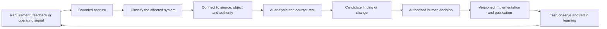

# Operations Automated connected system architecture

## Purpose

Operations Automated is developing several connected systems. They should learn from one another without sharing authority, audiences or outputs by accident.

## The four systems

| System | Purpose | Primary audience | Controlled output |
|---|---|---|---|
| Customer methodology | Explain how to understand, run, improve and prepare operations for automation, AI and agents | Future practitioners, teams and organisations | Books, practice guides, tools, templates and training |
| Internal methodology development system | Create, challenge, validate and evolve the customer methodology | Methodology Authority and authorised contributors | Source methodology, evidence, challenges, decisions and releases |
| Connected Governance | Help an organisation create and maintain linked governance | Operations Automated internally, then future customer organisations | Requirements, policies, controls, procedures, evidence, tests, findings and releases |
| Incident Manager RPG | Train and test incident-management capability through a standalone game | Incident managers and future customer organisations | Scenarios, training results and learning evidence |

The private AI Workbench supports the internal methodology development system. Connected Governance is a separate product and the Incident Manager RPG remains a separate project.

## Domain authority

- The **Operations Automated Governance Authority** decides company policy, material company-governance change, risk acceptance and Live internal governance publication.
- The **Operations Automated Methodology Authority** decides methodology meaning, methodology releases and external methodology publication.
- An AI Governance Agent may draft company governance but cannot approve it.
- An AI Methodology Agent may interpret evidence and draft methodology proposals but cannot approve them.
- A Publication Operator may execute an authorised plan but cannot create approval by publishing it.

One person may hold several roles during the founder-led phase. Reader documents name durable roles. Audit and decision records retain the actual human actor where accountability requires it.

## Governed synchronisation

Synchronisation means that a finding is classified, linked and routed. It does not mean that one system silently rewrites another.

| Finding concerns | Primary destination |
|---|---|
| Company policy, control or procedure | Operations Automated business governance |
| Connected Governance product behaviour | Connected Governance product backlog |
| Customer-methodology meaning | Methodology Workbench challenge |
| Explanation or reader experience | Methodology publication revision |
| Methodology-development practice | Internal methodology development system |
| Incident training or game design | Incident Manager RPG |

A finding may create linked candidates in more than one system. Each candidate retains its own source, authority, status and decision.

## Regulatory and governing sources

Connected Governance may receive manually entered requirements, controlled documents, authorised links and regulator or standards material. It should:

1. retain source identity, version, location and retrieval time;
2. extract candidate requirements and obligations with citations;
3. state applicability, interpretation, confidence and uncertainty;
4. map accepted requirements to policies, controls, procedures, owners, evidence and tests;
5. monitor authorised changes and operational findings; and
6. propose governed updates without granting AI legal, regulatory or approval authority.

Source availability and confident AI wording are not proof that a rule applies.

## Learning loop

Scenario results, risks, incidents, document comments and control evidence may all enter this loop. A signal does not become truth or approval merely because it is structured.

## Future collective interface

A later Operations Automated control centre may provide shared navigation, identity, connections, decisions and audit across:

- Methodology Workbench;
- Connected Governance;
- scenarios and training;
- publications;
- connections;
- approvals; and
- retained learning.

The systems should first prove their separate controlled cycles. A shared interface must not merge their data authority or approval routes.

## Current boundary

This architecture is proposed. It clarifies product and knowledge-system separation but does not approve external release, a new connection, automatic regulatory monitoring, methodology change, policy approval, Live publication or integration of the Incident Manager RPG.
